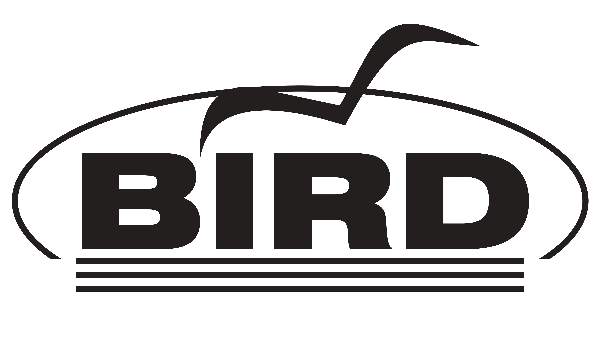

# FloofOS
## Fast Line-rate Offload On Fabric OS
High-performance network OS powered by VPP and BIRD

---

## What is FloofOS?

FloofOS is a high-performance network operating system that reimagines how routing and switching should work in modern infrastructure. Rather than relying on traditional kernel-based packet processing that struggles to keep pace with 10G, 25G, 40G, and 100G interfaces, FloofOS leverages userspace packet processing to achieve true line-rate forwarding on commodity hardware.

At its core, FloofOS combines two of the most powerful open-source networking technologies available today: **VPP** for the dataplane and **BIRD2** for the control plane. This combination delivers the performance of purpose-built network appliances with the flexibility and transparency of open-source software.

---

## The Case for VPP

<figure class="logo-right">
  
</figure>

Traditional router operating systems process packets through the Linux kernel network stack. While this approach is well-understood and battle-tested, it has fundamental limitations. Each packet traverses multiple layers of abstraction, incurs system call overhead, and competes for CPU cache with unrelated processes. At high packet rates, these inefficiencies compound into packet drops and increased latency.

**Vector Packet Processing (VPP)** takes a radically different approach. Developed originally by Cisco and now maintained by the [FD.io](https://fd.io) community under the Linux Foundation, VPP processes packets in batches (vectors) rather than individually. This design choice has profound implications:

When VPP processes a batch of 256 packets through the same graph node, the instruction cache stays hot, branch predictors remain accurate, and memory prefetching works efficiently. The per-packet overhead that dominates traditional stacks becomes negligible when amortized across hundreds of packets.

<figure class="logo-right">
  
</figure>

VPP also bypasses the kernel entirely for packet I/O. Using DPDK (Data Plane Development Kit), VPP polls network interfaces directly from userspace, eliminating interrupt overhead and context switches. The result is consistent, predictable performance measured in millions of packets per second per CPU core.

This is not theoretical performance. VPP powers production networks at major service providers, cloud platforms, and internet exchanges worldwide. It handles everything from basic IP forwarding to complex service chaining, from simple L2 switching to full MPLS and Segment Routing implementations.

---

## The Case for BIRD

<figure class="logo-right">
  
</figure>

The control plane is equally critical. FloofOS uses **BIRD Internet Routing Daemon (BIRD2)** for routing protocol implementation. BIRD has earned its reputation through decades of deployment at internet exchanges, transit providers, and large enterprises.

BIRD2 provides complete implementations of BGP, OSPF, RIP, and static routing with a configuration language that is both powerful and readable. Its filtering capabilities allow precise control over route selection, manipulation, and redistribution. For BGP-heavy deployments, BIRD's memory efficiency and convergence speed are particularly valuable.

FloofOS extends BIRD's capabilities through **Pathvector**, a declarative BGP configuration generator. Pathvector integrates with RPKI for route origin validation, queries IRR databases for prefix filtering, and supports PeeringDB for peer discovery. This automation eliminates the tedious and error-prone process of maintaining BGP filter lists manually.

---

## The Case for Go

<figure class="logo-right">
  
</figure>

While VPP handles the dataplane and BIRD manages routing protocols, FloofOS needs a robust management plane to tie everything together. **floofctl**, the command-line interface and orchestration layer of FloofOS, is built entirely in **Go**.

Go is an ideal choice for systems-level tooling like floofctl. It compiles to a single static binary with no external dependencies, making deployment straightforward on embedded and appliance-style systems. Go's strong standard library provides excellent support for networking, concurrency, and system interaction - all critical for a network OS management tool.

floofctl handles configuration management with **commit** and **rollback** support, interface provisioning, service orchestration between VPP and BIRD, and real-time system monitoring. Go's goroutine-based concurrency model makes it natural to manage multiple subsystems simultaneously without the complexity of traditional threading.

---

## Architecture & Inspiration

<figure class="logo-right">
  
</figure>

FloofOS's architecture is heavily inspired by the pioneering work at [ipng.ch](https://ipng.ch) by Pim van Pelt, who demonstrated that combining VPP's userspace dataplane with Linux-based routing daemons through the **Linux Control Plane (LCP)** plugin creates a powerful and practical network operating system. LCP synchronizes VPP interfaces with the Linux kernel, allowing BIRD to program routes that VPP enforces at line rate.

For a detailed look at the system architecture, see the [Architecture](architecture/index.md) section.

---

FloofOS is free software released under the GNU General Public License v3.
